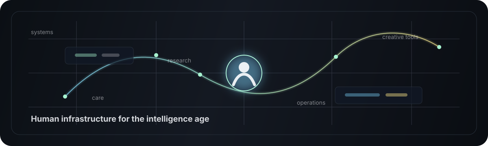
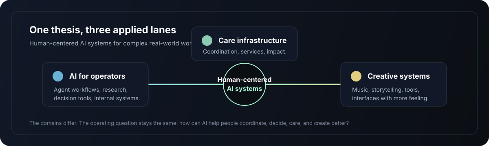

  

# Jason Towns

**Building human infrastructure for the intelligence age.**

I build human-centered AI systems for complex real-world work: care, coordination, research, operations, and creative production.

Most of my current work lives in private repos because it starts as operating infrastructure: prototypes, agent workflows, diligence tools, internal systems, and experiments built around specific human problems. This profile is the public edge of that work.

---

## What I am focused on

| Area | What it means in practice |
| --- | --- |
| **AI for operators** | Agent workflows, research systems, decision tools, and internal software for people moving through messy work. |
| **Care and human infrastructure** | Systems that make care, services, coordination, and community support easier to understand and operate. |
| **Creative systems** | Music, storytelling, and AI-assisted tools that help people make, shape, and remix ideas. |

  

## Active build zone

I am currently exploring:

- **Agentic workflows for real operators** - AI systems that help with research, triage, drafting, analysis, follow-up, and coordination.
- **AI-assisted diligence and decision support** - tools for turning scattered information into clearer judgment.
- **Care infrastructure and impact systems** - products and operating models for work that is high-touch, fragmented, and deeply human.
- **Creative AI experiments** - music, narrative, and interface ideas that make technology feel less sterile.

## Private repos, public edge

A lot of the useful work is private right now. That is intentional, not dormant.

The public version of this profile will grow around selected tools, notes, templates, and experiments once they become useful outside their original context. I am especially interested in sharing work that helps other builders make AI systems more grounded, legible, and humane.

## Selected work signals

| Signal | Why it matters |
| --- | --- |
| **Human-centered AI systems** | I care less about demos and more about tools that survive contact with real workflows. |
| **Care and coordination** | Some of the hardest product problems live in the places where people, institutions, and services meet. |
| **Acquisition-backed operations** | I am interested in how better tools can improve durable, useful businesses rather than only software-native startups. |
| **Creative AI** | Music and creative tools keep the work connected to taste, feeling, and culture. |

## How I tend to build

I usually work across strategy, product, and implementation:

- Map the human system before designing the software.
- Prototype quickly, then test against real constraints.
- Use AI where it improves judgment, speed, or coordination.
- Keep the interface clear enough for non-technical people to trust.
- Turn private experiments into reusable artifacts when they become generally useful.

## Tools and materials

`AI agents` | `LLM workflows` | `research systems` | `product strategy` | `Python` | `TypeScript` | `Next.js` | `automation` | `data workflows` | `creative systems`

## Public repo strategy

The first public repos here will likely be:

- A small AI/operator workflow or template.
- A research or diligence artifact.
- A creative AI experiment.
- A field-notes repo for applied AI and human systems.

## Connect

I am open to conversations with founders, operators, investors, care and impact teams, creative technologists, and builders working on serious systems.

If you are building something at the edge of AI and real human work, I would probably like to hear about it.
